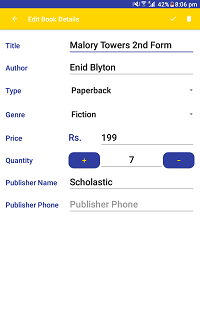

# Book Store Inventory
An application that stores inventory information about books. The data is stored on a local database i.e. on the device itself. Information can be added, updated and deleted. This project was a part of Udacity Google India Scholarship Android Basics Projects.

The following images depict the different activities that this application provides.

